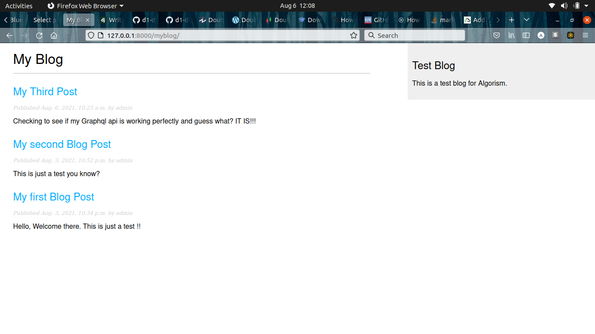
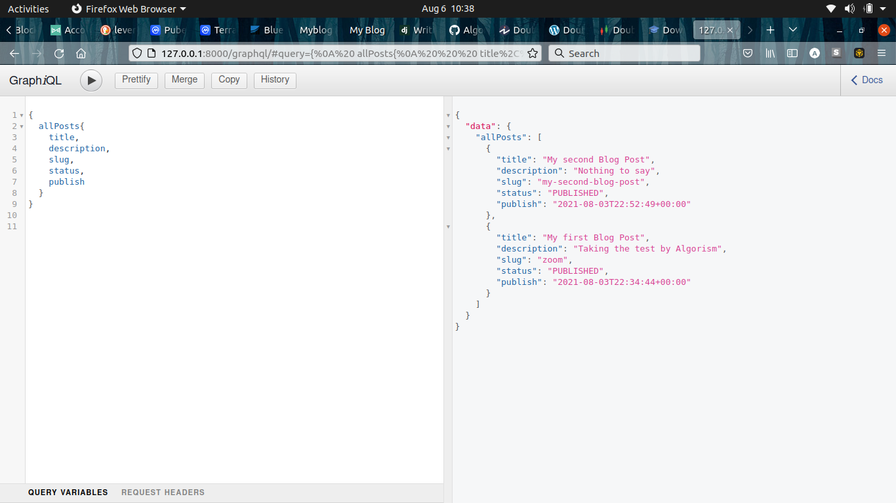
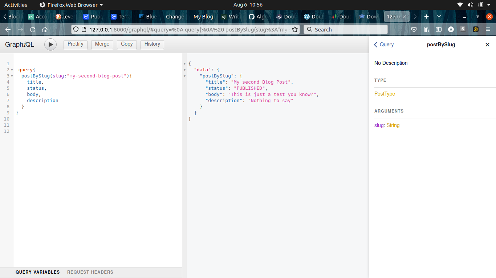

# Algorism-Blog-Test

This is an assessment by Algorism. 
A blog powered by Django backend and utilizes its templating system for the frontend. All errors have been rectified and the repository is now up to date.
GraphQL has been implemented and REST taken down.
Here is a sneak peak of the assestment:

GraphQL playground and Queries

